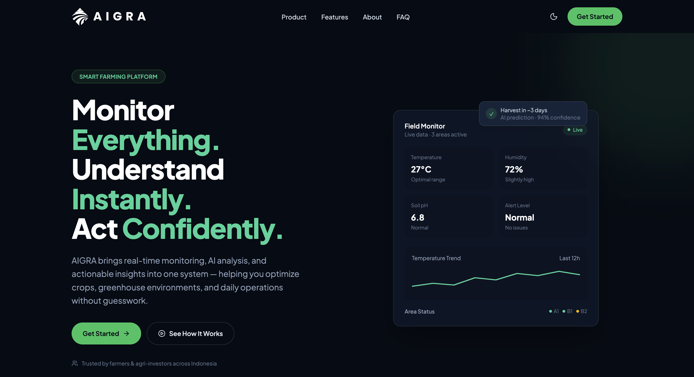
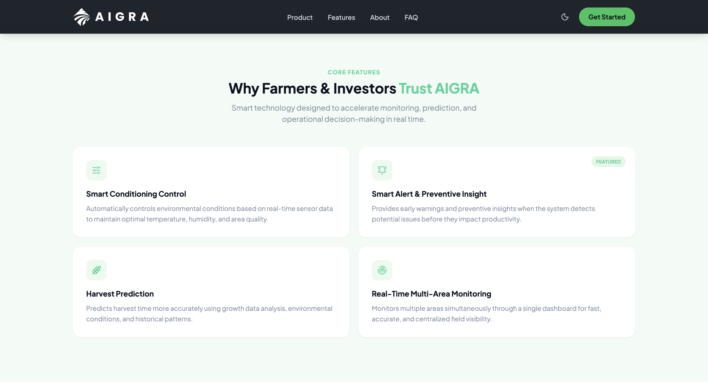
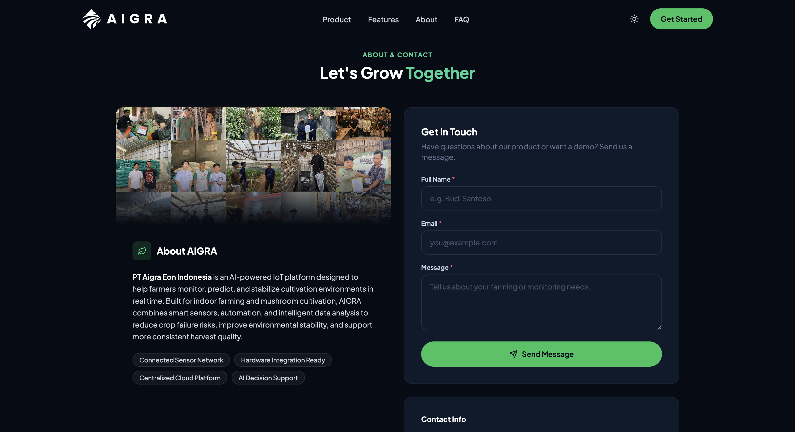
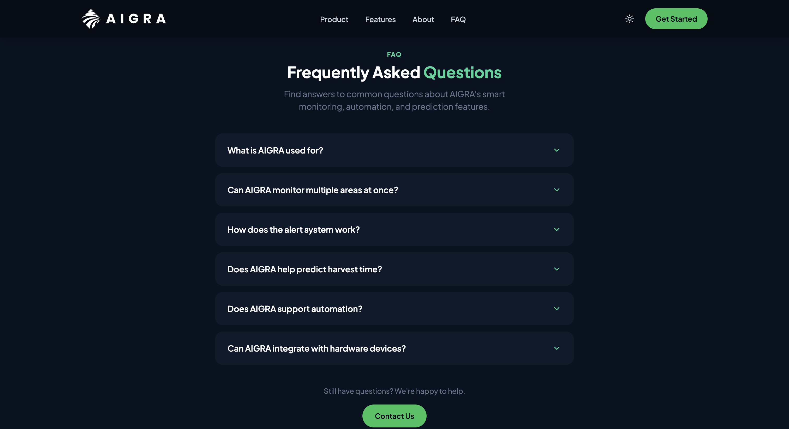

# AIGRA — Smart Farming Landing Page

Landing page untuk **PT AIGRA EON INDONESIA**, dibuat sebagai bagian dari Coding Test
UI/UX & Frontend Developer Intern (Program Magang 2026).

## Tech Stack

- **React.js** (functional components + hooks)
- **Vite** sebagai build tool
- **Tailwind CSS v4** untuk styling
- **lucide-react** untuk icon
- Form contact menggunakan local state (dummy submit, tanpa backend)

## Cara Menjalankan

```bash
# 1. Install dependencies
npm install

# 2. Jalankan development server
npm run dev

# 3. Buka di browser
http://localhost:5173
```

Build untuk production:

```bash
npm run build
npm run preview
```

## Struktur Folder

```
src/
├── assets/                  # gambar/icon statis
│   ├── aigra_putih.svg
│   └── aigra-about.png
├── components/              # 1 komponen per section
│   ├── Navbar.jsx
│   ├── Hero.jsx
│   ├── TrustBar.jsx
│   ├── ProblemSolution.jsx
│   ├── Features.jsx
│   ├── AboutContact.jsx
│   ├── FAQ.jsx
│   ├── Footer.jsx
│   └── Reveal.jsx           # wrapper animasi fade-in-on-scroll
├── context/
│   ├── theme-context.js     # context object (dipisah biar Fast Refresh aman)
│   └── ThemeContext.jsx     # ThemeProvider — state dark mode (React state, tanpa localStorage)
├── data/                    # konten berulang, dipisah dari JSX
│   ├── navLinks.js
│   ├── trustStats.js
│   ├── problemSolution.js
│   ├── features.js
│   ├── faqItems.js
│   ├── contactInfo.js
│   └── footerLinks.js
├── hooks/
│   ├── useScrollReveal.js   # Intersection Observer hook (fade-in on scroll)
│   └── useTheme.js          # hook untuk konsumsi ThemeContext
├── App.jsx
├── main.jsx
└── index.css                # Tailwind + design tokens (warna, font)
```

## Struktur Halaman

1. **Navbar** — logo, menu (Product, Features, About, FAQ), toggle dark mode,
   CTA "Get Started", hamburger menu untuk mobile/tablet
2. **Hero** — badge "Smart Farming Platform", headline, sub-headline, CTA
   primary + secondary, trust indicator, dashboard mockup card
3. **Trust Bar** — 3 stat card (30%, 5 Hrs, AI + IoT)
4. **Problem → Solution** — perbandingan Traditional Farming vs AIGRA's Way
5. **Features** — 4 feature card dengan icon (1 ditandai "Featured")
6. **About & Contact** — profil perusahaan + info kontak + form contact
7. **FAQ** — accordion, expand/collapse satu per satu
8. **Footer** — brand, links, contact, CTA

## Screenshot

<p align="center">
  
  
</p>
<p align="center">
  
  
</p>

- `Hero + Navbar`
- `Trust Bar & Problem/Solution`
- `Features section`
- `About & Contact`
- `FAQ accordion`
- `Footer`
- `Mobile view (hamburger menu terbuka)`

## Deployment

Link demo: `https://aigra-smartfarming.vercel.app/`
